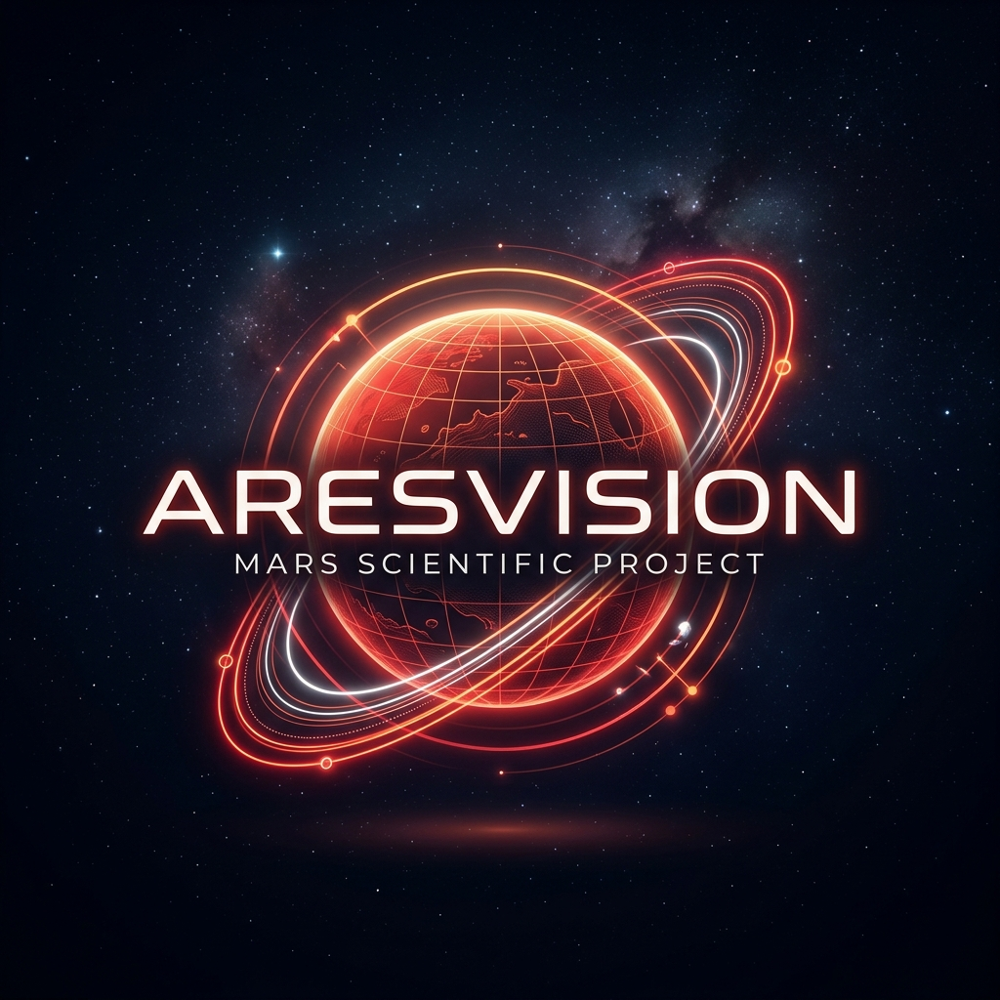

# AresVision 智绘赤星

<div align="center">
  
  <p align="center">
    <strong>Mars Ozone Column Prediction & Visualization System</strong><br />
    基于深度学习的火星臭氧柱浓度预测与多维交互可视化平台
  </p>

  [](https://www.python.org/)
  [](https://fastapi.tiangolo.com/)
  [](https://react.dev/)
  [](https://pytorch.org/)
  [](LICENSE)
</div>

---

## 🌍 项目背景

随着人类探索火星进程的加速，深入理解火星大气演化规律已成为行星科学研究的核心课题。火星臭氧（O₃）作为火星大气化学的关键追踪物，其浓度的时空变化不仅直接反映了大气的光化学循环与动力学传输，更是评估火星表面紫外辐射环境的重要指标。

然而，传统的火星气象研究面临多重挑战：
- **观测数据稀疏性**：尽管现有轨道器提供了宝贵观测，但在时间和空间覆盖上仍存在大量空白，难以捕捉瞬时的全球演化趋势。
- **物理模拟复杂性**：传统全球气候模型（GCM）计算量巨大，且对非线性气象突变（如全球性沙尘暴）的建模能力有限。
- **数据孤岛与分析门槛**：海量的 NetCDF 数据与再分析资料对科研人员而言存在较高的可视化与多维解析门槛。

**AresVision (智绘赤星)** 旨在通过尖端的 **PredRNNv2** 时空循环神经网络，从海量的 **OpenMARS** 与 **MCD 6.1** 异构数据中挖掘深层次的时空相关性。我们不仅构建了一个高精度的预测推理引擎，更打造了一个集 **“多源数据融合 - 深度时空学习 - 可解释性归因 - 3D 数字孪生可视化”** 于一体的智能化科研平台，为火星气象研究提供从底层数据到顶层决策的全链路支持。

## 🌟 项目简介

**AresVision (智绘赤星)** 是一个融合前沿深度学习技术与 3D 可视化交互的火星气象研究系统。系统以 PredRNNv2 时空卷积神经网络为核心，通过集成 OpenMARS 再分析数据与 MCD 6.1 气候模拟数据，实现了对火星大气臭氧的时空演化高精度预测，并提供了沉浸式的科研级可视化工作流。

## 🚀 核心功能：AresVision AI 全链路实验室

### 1. 🌀 尖端时空序列预测引擎 (PredRNNv2)
- **非线性动力学捕捉**：采用集成 **ST-LSTM** 单元的 **PredRNNv2** 架构，突破传统卷积在时间尺度上的长短期记忆局限，实现对火星 7 维气象张量的复杂时空演化建模。
- **滑窗推理机制**：基于 **3-Step 历史观测序列**，精准输出未来 **3-Step 全球臭氧柱浓度分布图谱**。
- **三联画 (Triptych) 验证**：内置“地面真值-预测分布-残差分析”平行视窗，实现对模型预测一致性与边界效应的实时评估。

### 2. 🔍 可解释性 AI 归因分析 (XAI - SHAP)
- **特征贡献解构**：深度集成 **SHAP (Shapley Additive Explanations)** 归因算法，将黑盒模型透明化。
- **多维度归因视图**：提供全屏 **Waterfall 贡献流图**与**特征相关性矩阵**，客观量化温度、气压、沙尘丰度（Dust Opacity）等 7 种气候变量对预测结果的影响阈值。

### 3. 🤖 模型演化与超参数实验室
- **端到端自动训练链**：支持实时在线配置 **Epochs、Learning Rate、ST-LSTM 层数及隐藏层维度**。
- **收敛动力学监控**：毫秒级推算 **Loss 演化曲线**与训练进度，支持异常任务的毫秒级熔断。
- **灵活消融实验**：支持自定义输入通道组合（如：仅 O₃ vs O₃+温度+风速），用于验证多源数据融合对模型泛化性能的提升。

### 4. 🛰️ 多源异构远程遥感数据融合
- **自动对齐算法**：针对 **OpenMARS** 再分析数据与 **MCD 6.1** 气候数据库，实现了多分辨率、跨坐标系的空间像素级对齐（Data Alignment）。
- **众包贡献与质量评估**：支持 NC 格式专业气象数据上传，内置基于气象约束的自动化数据合规性校验。

### 5. 🪐 火星数字孪生 3D 可视化
- **高保真球体渲染**：基于 WebGL/Three.js 的实时渲染引擎，将模型预测的全球热力场无缝映射至 3D 火星数字孪生体。
- **全屏沉浸式 HUD**：为科研演示设计的沉浸式交互界面，支持实时动态投影与 Ls（太阳黄经）轴演化追踪。

### 6. 🧠 专家级 LLM 气候解读代理
- **语义化数据解析**：利用大语言模型（LLM）对预测结果、性能指标及气象异常进行深度语义分析。
- **自然语言知识库检索**：结合 RAG 技术，为用户提供关于火星大气运作机制的专家级实时咨询。

## 🛠️ 技术栈

| 领域 | 核心技术 | 说明 |
| :--- | :--- | :--- |
| **前端** | React 19 / Vite / Three.js / MUI / Plotly | 高交互、响应式科研界面 |
| **后端** | FastAPI / Uvicorn / SQLAlchemy / Pydantic | 高性能异步 API 中枢 |
| **AI/ML** | PyTorch / PredRNNv2 / SHAP / Scikit-learn | 时空预测与归因分析 |
| **数据** | xarray / netCDF4 / NumPy / SciPy | 专业气象数据处理 |
| **数据库** | SQLite / PostgreSQL (支持扩展) | 用户、任务、贡献数据持久化 |

## 📂 项目结构

```text
AresVision/
├── AresVision_backend/      # 后端逻辑
│   └── backend/
│       ├── core/            # PredRNNv2 模型架构与数据变换 (Transforms)
│       ├── routers/         # API 路由 (Analysis, Predict, AI, Auth, Training, etc.)
│       ├── services/        # 核心业务逻辑 (Predict Orchestrator, AI Service)
│       ├── database/        # 数据库模型与迁移
│       ├── data/            # 本地气象数据集存放 (OpenMARS/MCD)
│       └── models/          # 训练好的模型权重 (.pt)
├── frontend/                # 前端工程
│   ├── src/
│   │   ├── components/      # 复用 UI 组件 (Chart, HUD, Table)
│   │   ├── pages/           # 功能页面 (Predict, Training, Explore, Overview)
│   │   ├── i18n/            # 国际化支持 (中/英)
│   │   └── contexts/        # 全局状态管理 (Auth, Settings, Training)
└── assets/                  # 静态资源 (Logo, Docs Images)
```

## 🏁 快速启动

### 1. 环境准备
- **Node.js**: v18.0+
- **Python**: v3.10+
- **GPU (可选)**: 建议使用支持 CUDA 的显卡以提升训练速度。

### 2. 后端部署
```bash
cd AresVision_backend/backend
# 安装依赖
pip install -r requirements.txt
# 配置环境变量 (AI API, etc.)
cp .env.example .env  # 需自行根据需求填充
# 启动服务
uvicorn main:app --reload --host 0.0.0.0 --port 8000
```

### 3. 前端部署
```bash
cd frontend
# 安装依赖
npm install
# 启动开发服务器
npm run dev
```
访问 `http://localhost:5173` 即可开启探索。

## 📜 环境变量说明

在 `backend/.env` 中可配置以下关键项：
- `AI_API_KEY`: 连接 AI 助手所需的 API Key。
- `DATABASE_URL`: 数据库连接字符串（默认使用 SQLite）。
- `JWT_SECRET`: 用户认证加密密钥。

---

## 📅 路线图
- [ ] 开发集成实时卫星遥感数据流接口。
- [ ] 增加 VR 模式以实现更真实的火星表面漫游。
- [ ] 优化 PredRNNv3 模型以支持更长周期的预测。

## 🤝 参与贡献
欢迎通过 Pull Requests 或 Issues 为项目贡献代码或建议。在提交 PR 前，请确保已阅读并遵守项目的开发规范。

## 📄 开源协议
本项目采用 [MIT License](LICENSE) 协议。

---
<p align="center">
  由 <strong>AresVision 开发团队</strong> 倾力打造 | 探索赤星，智绘未来
</p>
